# Логика получения истории задач для отчета TTM Details

## Блок-схема процесса

```mermaid
flowchart TD
    Start([Начало generate_csv]) --> LoadConfig["Загрузка конфигурации:<br/>Кварталы и статусы завершения"]
    LoadConfig --> GetTasks["Получение задач:<br/>_get_ttm_tasks_for_date_range_corrected"]

    GetTasks --> QueryTasks["SQL запрос:<br/>get_tasks_for_period<br/>с фильтрацией по TTM"]
    QueryTasks --> TasksList["Список TaskData объектов"]

    TasksList --> LoopStart{"Для каждой задачи"}
    LoopStart --> GetHistory["Получение истории:<br/>data_service.get_task_history"]

    GetHistory --> SQLQuery["SQL запрос к БД:<br/>SELECT из TrackerTaskHistory<br/>WHERE task_id<br/>ORDER BY start_date"]

    SQLQuery --> CheckError{"Ошибка запроса?"}
    CheckError -->|Да| Rollback["Откат транзакции<br/>Возврат пустого списка"]
    CheckError -->|Нет| ConvertToEntries["Преобразование записей<br/>в StatusHistoryEntry объекты"]

    ConvertToEntries --> FilterShort["Фильтрация коротких переходов:<br/>_filter_short_transitions"]

    FilterShort --> FilterLogic["Проверка длительности статуса:<br/>duration больше min_duration"]

    FilterLogic --> ReturnHistory["Возврат отфильтрованной истории"]

    ReturnHistory --> CalcMetrics["Расчет метрик:<br/>TTM, TTD, Tail, DevLT, Паузы"]

    CalcMetrics --> CheckUnfinished{"Есть незавершенные задачи?"}
    CheckUnfinished -->|Да| GetUnfinished["Получение незавершенных задач:<br/>_get_unfinished_tasks"]
    GetUnfinished --> GetHistoryUnfinished["Для каждой незавершенной задачи:<br/>get_task_history"]
    GetHistoryUnfinished --> CalcUnfinishedMetrics["Расчет метрик для незавершенных задач"]

    CheckUnfinished -->|Нет| BatchReturns["Batch расчет возвратов:<br/>_calculate_all_returns_batched"]
    CalcUnfinishedMetrics --> BatchReturns

    BatchReturns --> BuildHierarchy["Построение иерархии:<br/>CPO к FULLSTACK"]
    BuildHierarchy --> BatchLoadHistories["Пакетная загрузка историй:<br/>get_task_histories_by_keys_batch"]

    BatchLoadHistories --> BatchSQLQuery["SQL запрос с JOIN:<br/>SELECT TrackerTask.key<br/>JOIN TrackerTaskHistory<br/>WHERE key IN список<br/>ORDER BY key, start_date"]

    BatchSQLQuery --> BatchConvert["Преобразование в словарь:<br/>key к List StatusHistoryEntry"]

    BatchConvert --> CalcReturns["Расчет возвратов для каждой задачи"]

    CalcReturns --> FormatRows["Форматирование строк отчета"]
    FormatRows --> WriteCSV["Запись в CSV файл"]
    WriteCSV --> End([Конец])

    Rollback --> End
    LoopStart -->|Следующая задача| GetHistory

    style Start fill:#90EE90
    style End fill:#FFB6C1
    style SQLQuery fill:#87CEEB
    style BatchSQLQuery fill:#87CEEB
    style FilterShort fill:#FFD700
    style CalcMetrics fill:#DDA0DD
    style BatchReturns fill:#F0E68C
```



## Пошаговое описание логики

### 1. Инициализация и загрузка конфигурации

**Метод:** `generate_csv()` → `_collect_csv_rows()`

- Загружаются кварталы из конфигурации через `_load_quarters()`
- Загружаются статусы завершения через `_load_done_statuses()`
- Определяется диапазон дат: от начала первого квартала до конца последнего

### 2. Получение списка задач

**Метод:** `_get_ttm_tasks_for_date_range_corrected()`

- Вызывается `data_service.get_tasks_for_period()` с параметрами:
  - `start_date` и `end_date` - границы периода
  - `group_by=GroupBy.AUTHOR` - группировка по автору
  - `status_mapping` - маппинг статусов из конфигурации
  - `metric_type="ttm"` - фильтрация только задач с метрикой TTM
- Возвращается список объектов `TaskData` с полями: `id`, `key`, `author`, `team`, `summary`, `created_at`

### 3. Получение истории для каждой задачи (основной цикл)

**Метод:** `data_service.get_task_history(task_id: int)`

#### 3.1. SQL запрос к базе данных

```sql
SELECT
    status,
    status_display,
    start_date,
    end_date
FROM TrackerTaskHistory
WHERE task_id = ?
ORDER BY start_date
```

- Запрос выполняется через SQLAlchemy ORM
- Результаты упорядочиваются по `start_date` для хронологической последовательности

#### 3.2. Преобразование в объекты StatusHistoryEntry

Для каждой записи из БД создается объект `StatusHistoryEntry`:
- `status` - системное имя статуса
- `status_display` - отображаемое имя статуса
- `start_date` - дата начала статуса
- `end_date` - дата окончания статуса (может быть `None` для текущего статуса)

#### 3.3. Фильтрация коротких переходов

**Метод:** `_filter_short_transitions()` → `metrics_service._filter_short_status_transitions()`

- Проверяется длительность каждого статуса: `duration = end_date - start_date`
- Если `duration < min_status_duration_seconds` (обычно 5 минут), переход исключается
- Это необходимо для фильтрации случайных или ошибочных смен статусов

#### 3.4. Обработка ошибок

- При ошибке SQL запроса выполняется `db.rollback()`
- Возвращается пустой список `[]`
- Ошибка логируется через `logger.error()`

### 4. Использование истории для расчета метрик

После получения истории для каждой задачи вызываются методы расчета метрик:

- **`_calculate_ttm()`** - Time To Market (время от создания до завершения)
- **`_calculate_ttd()`** - Time To Delivery (время до статуса "Готова к разработке")
- **`_calculate_tail()`** - время в статусе "МП / Внешний тест" до первого done-статуса
- **`_calculate_devlt()`** - Development Lead Time (время разработки)
- **`_calculate_pause()`** - общее время пауз
- **`_calculate_ttd_pause()`** - паузы до статуса "Готова к разработке"
- **`_calculate_discovery_backlog_days()`** - время в статусе "Discovery backlog"
- **`_calculate_ready_for_dev_days()`** - время в статусе "Готова к разработке"
- **`_has_valid_work_status()`** - проверка наличия валидного статуса "МП / В работе"

**Важно:** Все эти методы принимают опциональный параметр `history`, что позволяет переиспользовать уже загруженную историю и избежать повторных запросов к БД.

### 5. Обработка незавершенных задач

**Метод:** `_get_unfinished_tasks()`

- Получаются все задачи, которые перешли в "Готова к разработке" (метрика TTD)
- Для каждой задачи загружается история через `get_task_history()`
- Проверяется наличие `stable_done` через `metrics_service._find_stable_done()`
- Если `stable_done` отсутствует, задача считается незавершенной
- Для незавершенных задач метрики рассчитываются до текущей даты

### 6. Пакетная загрузка истории для расчета возвратов

**Метод:** `_calculate_all_returns_batched()`

#### 6.1. Построение иерархии задач

- Для каждой CPO задачи строится иерархия связанных FULLSTACK задач
- Используется `testing_returns_service.build_fullstack_hierarchy_batched()`
- Собираются все уникальные ключи FULLSTACK задач

#### 6.2. Пакетная загрузка истории

**Метод:** `data_service.get_task_histories_by_keys_batch(task_keys: List[str])`

**SQL запрос с JOIN:**
```sql
SELECT
    TrackerTask.key,
    TrackerTaskHistory.status,
    TrackerTaskHistory.status_display,
    TrackerTaskHistory.start_date,
    TrackerTaskHistory.end_date
FROM TrackerTask
JOIN TrackerTaskHistory
    ON TrackerTask.id = TrackerTaskHistory.task_id
WHERE TrackerTask.key IN (?)
ORDER BY TrackerTask.key, TrackerTaskHistory.start_date
```

- За один запрос загружается история для всех FULLSTACK задач
- Результат группируется в словарь: `{task_key: List[StatusHistoryEntry]}`
- Это оптимизирует производительность при большом количестве задач

#### 6.3. Расчет возвратов

- Для каждой CPO задачи используется история связанных FULLSTACK задач
- Рассчитываются возвраты с Testing и Внешний тест
- Результаты агрегируются на уровне CPO задачи

### 7. Формирование отчета

- Все метрики собираются в структуру данных
- Формируются строки CSV через `_format_task_row()`
- Данные записываются в CSV файл

## Оптимизации производительности

1. **Пакетная загрузка истории** - метод `get_task_histories_by_keys_batch()` загружает историю для множества задач одним SQL запросом вместо N отдельных запросов

2. **Переиспользование истории** - методы расчета метрик принимают опциональный параметр `history`, что позволяет избежать повторных запросов к БД

3. **Фильтрация на уровне SQL** - задачи фильтруются по `metric_type="ttm"` на этапе SQL запроса, а не после загрузки всех данных

4. **JOIN вместо подзапросов** - при пакетной загрузке используется JOIN между TrackerTask и TrackerTaskHistory для эффективного получения данных

## Структура данных StatusHistoryEntry

```python
class StatusHistoryEntry:
    status: str              # Системное имя статуса (например, "Открыт")
    status_display: str       # Отображаемое имя (например, "Открыт")
    start_date: datetime      # Дата начала статуса
    end_date: Optional[datetime]  # Дата окончания (None для текущего статуса)
```

## Обработка граничных случаев

1. **Отсутствие истории** - возвращается пустой список, метрики не рассчитываются
2. **Ошибки БД** - выполняется rollback, возвращается пустой список, ошибка логируется
3. **Незавершенные задачи** - метрики рассчитываются до текущей даты
4. **Короткие переходы** - фильтруются для исключения случайных смен статусов
5. **Отсутствие связанных задач** - для расчета возвратов возвращается (0, 0)
